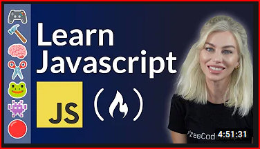

# Vanilla JS GameDev

## Course 1: [JavaScript Game Development Course for Beginners](https://www.youtube.com/watch?v=GFO_txvwK_c)

 

This starts with sprite animation and other stuff, but **honestly speaking it wont help with learning JS functions and other importatnt stuff at all**

Can finish for the sake of it

## Course 2: [Learn JavaScript by Building 7 Games - Full Course](https://www.youtube.com/watch?v=ec8vSKJuZTk)

This looks promising

